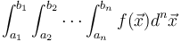

# HCubature

The HCubature module is a pure-Julia implementation of
multidimensional "h-adaptive" integration.  That is, given
an n-dimensional integral

then `hcubature(f, a, b)` computes the integral, adaptively subdividing
the integration volume into smaller and smaller pieces until convergence
is achieved to the desired tolerance (specified by optional `rtol` and
`atol` keyword arguments, described in more detail below.

Because `hcubature` is written purely in Julia, the integrand `f(x)`
can return any vector-like object (technically, any type supporting
`+`, `-`, `*` real, and `norm`: a Banach space).  You can integrate
real, complex, and matrix-valued integrands, for example.

## Usage

Assuming you've installed the HCubature package (via `Pkg.add`) and
loaded it with `using HCubature`, you can then use it by calling
the `hcubature` function:

### `hcubature`

    hcubature(f, a, b; norm=norm, rtol=sqrt(eps), atol=0, maxevals=typemax(Int), initdiv=1)

This computes the n-dimensional integral of f(x), where `n == length(a) == length(b)`,
over the hypercube whose corners are given by the vectors (or tuples) `a` and `b`.
That is, dimension `x[i]` is integrated from `a[i]` to `b[i]`.  The
return value of `hcubature` is a tuple `(I, E)` of the estimated integral
`I` and an estimated error `E`.

`f` should be a function `f(x)` that takes an n-dimensional vector `x`
and returns the integrand at `x`.   The integrand can be any type that supports
`+`, `-`, `*` real, and `norm` functions.  For example, the integrand
can be real or complex numbers, vectors, matrices, etcetera.
(For performance, the [StaticArrays](https://github.com/JuliaArrays/StaticArrays.jl)
package is recommended for use with vector/matrix-valued integrands.)

The integrand `f(x)` will be always be passed an `SVector{n,T}`,
where `SVector` is an efficient vector type defined in the [StaticArrays](https://github.com/JuliaArrays/StaticArrays.jl)
package and `T` is a floating-point type determined by promoting
the endpoint `a` and `b` coordinates to a floating-point type.
(Your integrand `f` should be type-stable: it should always return
a value of the same type, given this type of `x`.)

The integrand will never be evaluated exactly at the boundaries of the
integration volume.  (So, for example, it is possible to have an
integrand that blows up at the boundaries, as long as the integral
is finite, though such singularities will slow convergence.)

The integration volume is adaptively subdivided, using a cubature
rule due to Genz and Malik (1980), until the estimated error `E`
satisfies `E ≤ max(rtol*norm(I), atol)`, i.e. `rtol` and `atol` are
the relative and absolute tolerances requested, respectively.
It also stops if the number of `f` evaluations exceeds `maxevals`.
If neither `atol` nor `rtol` are specified, the
default `rtol` is the square root of the precision `eps(T)`
of the coordinate type `T` described above.
Initially, the volume is divided into `initdiv` segments along each dimension.

The error is estimated by `norm(I - I′)`, where `I′` is an alternative
estimated integral (via an "embedded" lower-order cubature rule.)
By default, the `norm` function used (for both this and the convergence
test above) is `norm`, but you can pass an alternative norm by
the `norm` keyword argument.  (This is especially useful when `f`
returns a vector of integrands with different scalings.)

### `hquadrature`

    hquadrature(f, a, b; norm=norm, rtol=sqrt(eps), atol=0, maxevals=typemax(Int), initdiv=1)

Compute the (1d) integral of f(x) from `a` to `b`.  The
return value of `hcubature` is a tuple `(I, E)` of the estimated integral
`I` and an estimated error `E`.

The other parameters are the same as `hcubature` (above).  `hquadrature`
is just a convenience wrapper around `hcubature` so that you can work
with scalar `x`, `a`, and `b`, rather than 1-component vectors.

Alternatively, for 1d integrals you can import the [QuadGK](https://github.com/JuliaMath/QuadGK.jl) module
and call the [`quadgk`](https://juliamath.github.io/QuadGK.jl/stable/#QuadGK.quadgk) function, which provides additional flexibility
e.g. in choosing the order of the quadrature rule.  (`QuadGK` is used
internally anyway by `HCubature` to compute the quadrature rule.)

## Algorithm

The algorithm of `hquadrature` is based on the one described in:

* A. C. Genz and A. A. Malik, "[An adaptive algorithm for numeric integration over an N-dimensional rectangular region](https://doi.org/10.1016/0771-050X(80)90039-X)," *J. Comput. Appl. Math.*, vol. 6 (no. 4), 295-302 (1980).

## Author and Copyright

HCubature was written by [Steven G. Johnson
(SGJ)](http://math.mit.edu/~stevenj/), and is free/open-source
software under the [MIT/expat license](LICENSE.md).

SGJ also wrote an earlier [C implementation of a similar
algorithm](http://ab-initio.mit.edu/wiki/index.php/Cubature) that is
also callable from Julia via the [Cubature.jl
package](https://github.com/stevengj/Cubature.jl).  The HCubature
package is a from-scratch re-implementation, not a translation, of
this code, both to take advantage of unique features of Julia and to
eliminate licensing restrictions arising from the use of C code taken
from the [HIntLib library](http://mint.sbg.ac.at/HIntLib/).   (In both
cases, the original DCUHRE Fortran code of Genz was not examined, only
the mathematical description in the papers.)
